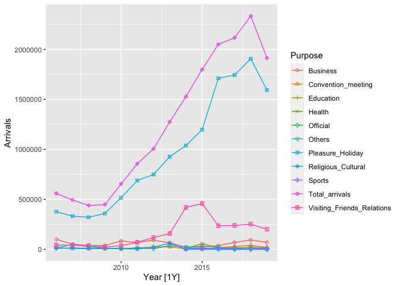

<!-- README.md is generated from README.Rmd. Please edit that file -->

# datahut

<!-- badges: start -->

<!-- badges: end -->

`datahut` provides datasets for statistical data analysis.

## Installation

You can install the development version from
[GitHub](https://github.com/) with:

``` r
# install.packages("devtools")
devtools::install_github("pridiltal/datahut")
```

## Example

This is a basic example which shows you how to solve a common problem:

### Tourism in Sri Lanka

**Special events**

  - There was a civil war in the country from July 1983 to May 2009.
  - On 26 December 2004, Sri Lanka became a victim of the Indian Ocean
    Tsunami.
  - Sri Lanka Easter bombings happened on 21 April 2019.

<!-- end list -->

``` r
library(datahut)
## basic example code
library(fable)
#> Loading required package: fabletools
library(ggplot2)
head(touristsl)
#> # A tsibble: 6 x 2 [1Y]
#>    Year Arrivals
#>   <int>    <dbl>
#> 1  1970    46247
#> 2  1971    39654
#> 3  1972    56047
#> 4  1973    77888
#> 5  1974    85011
#> 6  1975   103204
autoplot(touristsl)+
  ggtitle("Tourist arrivals to Sri Lanka from 1970 to 2018")+
  xlab("Year") +
  ylab("Tourist Arrivals")
#> Plot variable not specified, automatically selected `.vars = Arrivals`
```


``` r
head(touristsl_monthly)
#> # A tsibble: 6 x 2 [1M]
#>      Month Arrivals
#>      <mth>    <int>
#> 1 1971 Jan     5931
#> 2 1971 Feb     6570
#> 3 1971 Mar     5166
#> 4 1971 Apr     1539
#> 5 1971 May      952
#> 6 1971 Jun      961
touristsl_monthly%>% autoplot(Arrivals)
```


``` r
touristsl_monthly[433:588,]  %>% autoplot()
#> Plot variable not specified, automatically selected `.vars = Arrivals`
```


``` r
library(feasts)
touristsl_monthly %>%
  feasts::gg_season(Arrivals, labels = "both") +   ylab("Arrivals") +
ggtitle("Seasonal plot: Monthly tourist arrivals to Sri Lanka")
```


``` r
touristsl_monthly %>%
feasts::gg_subseries(Arrivals) + ylab("Arrivals") + ggtitle("Subseries plot: Monthly tourist arrivals to Sri Lanka")
```


#### Tourist arrivals to Sri Lanka by purpose of visit

``` r
head(touristsl_purpose)
#> # A tsibble: 6 x 3 [1Y]
#> # Key:       Purpose [1]
#>    Year Purpose  Arrivals
#>   <int> <chr>       <dbl>
#> 1  2006 Business    99609
#> 2  2007 Business    51871
#> 3  2008 Business    37270
#> 4  2009 Business    38519
#> 5  2010 Business    83118
#> 6  2011 Business    68478
p<- autoplot(touristsl_purpose) +
  geom_point(aes(shape= Purpose)) +
  scale_shape_manual(values = 1:11)
#> Plot variable not specified, automatically selected `.vars = Arrivals`
print(p)
#> Warning: Removed 32 row(s) containing missing values (geom_path).
#> Warning: Removed 32 rows containing missing values (geom_point).
```



### Unemployment in Sri Lanka

``` r
library(tidyverse)
#> ── Attaching packages ─────────────────────────────────────── tidyverse 1.3.0 ──
#> ✓ tibble  3.0.4     ✓ dplyr   1.0.2
#> ✓ tidyr   1.1.2     ✓ stringr 1.4.0
#> ✓ readr   1.4.0     ✓ forcats 0.5.0
#> ✓ purrr   0.3.4
#> ── Conflicts ────────────────────────────────────────── tidyverse_conflicts() ──
#> x dplyr::filter() masks stats::filter()
#> x dplyr::lag()    masks stats::lag()
head(unemp_ratesl)
#> # A tsibble: 6 x 4 [1Y]
#>    Year Total  Male Female
#>   <int> <dbl> <dbl>  <dbl>
#> 1  1990  15.9  11.1   23.4
#> 2  1991  14.7  10.1   23  
#> 3  1992  14.6  10.7   22.8
#> 4  1993  13.8   9.7   21.7
#> 5  1994  13.1   9.7   20.1
#> 6  1995  12.3   9     18.7
unemp_ratesl %>% autoplot(Total)
```


``` r
p <- unemp_ratesl %>%
  select(Year, Male, Female) %>%
  pivot_longer(-Year, names_to = "Gender", values_to = "Unemployment_rate") %>%
  as_tsibble(index = Year, key = Gender) %>%
  autoplot()
#> Plot variable not specified, automatically selected `.vars = Unemployment_rate`

print(p)
```


